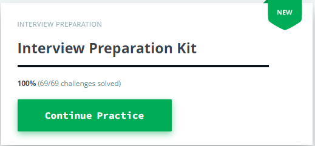

# HackerRank-Interview-Preparation-Kit-Solutions

This Repository contains a complete set of java and C++ solutions for the **[HackerRank Interview Preparation Kit](https://www.hackerrank.com/interview/interview-prep-kit)**.  

## 📚 Table of Contents  

- [Warm-Up Challenges](https://github.com/meghna2807/HackerRank-Interview-Preparation-Kit-Solutions/tree/main/Warm-Up%20Challenges)
- [Arrays](https://github.com/meghna2807/HackerRank-Interview-Preparation-Kit-Solutions/tree/main/Arrays)
- [Dictionaries and Hashmaps](https://github.com/meghna2807/HackerRank-Interview-Preparation-Kit-Solutions/tree/main/Dictionaries%20and%20Hashmaps)
- [Sorting](https://github.com/meghna2807/HackerRank-Interview-Preparation-Kit-Solutions/tree/main/Sorting)
- [String Manipulation](https://github.com/meghna2807/HackerRank-Interview-Preparation-Kit-Solutions/tree/main/String%20Manipulation)
- [Greedy Algorithms](https://github.com/meghna2807/HackerRank-Interview-Preparation-Kit-Solutions/tree/main/Greedy%20Algorithms)
- [Search](https://github.com/meghna2807/HackerRank-Interview-Preparation-Kit-Solutions/tree/main/Search)
- [Dynamic Programming](https://github.com/meghna2807/HackerRank-Interview-Preparation-Kit-Solutions/tree/main/Dynamic%20Programming)
- [Stacks and Queues](https://github.com/meghna2807/HackerRank-Interview-Preparation-Kit-Solutions/tree/main/Stacks%20and%20Queues)
- [Trees](https://github.com/meghna2807/HackerRank-Interview-Preparation-Kit-Solutions/tree/main/Trees)
- [Linked Lists](https://github.com/meghna2807/HackerRank-Interview-Preparation-Kit-Solutions/tree/main/Linked%20Lists)
- [Recursion and Backtracking](https://github.com/meghna2807/HackerRank-Interview-Preparation-Kit-Solutions/tree/main/Recursion%20and%20Backtracking)
- [Miscellaneous](https://github.com/meghna2807/HackerRank-Interview-Preparation-Kit-Solutions/tree/main/Miscellaneous)

